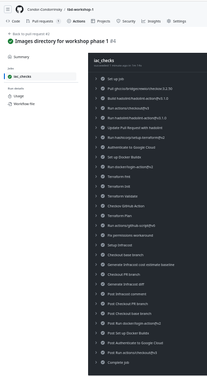

IMPORTANT ❗ ❗ ❗ Please remember to destroy all the resources after each work session. You can recreate infrastructure by creating new PR and merging it to master.
  


1. Authors:

Grupa nr 2 w skladzie:
    - Dumin Konrad 310974
    - Kiernozek Jakub
    - Gniewek Aleksandra

Repozytorium nalezy do Konrada:
https://github.com/Condor-Condorrinsky/tbd-workshop-1
   
2. Follow all steps in README.md.

3. Select your project and set budget alerts on 5%, 25%, 50%, 80% of 50$ (in cloud console -> billing -> budget & alerts -> create buget; unclick discounts and promotions&others while creating budget).

  

Ustalony budzet:
    

5. From avaialble Github Actions select and run destroy on main branch.
   
7. Create new git branch and:
    1. Modify tasks-phase1.md file.
    
    2. Create PR from this branch to **YOUR** master and merge it to make new release. 
    
    

8. Analyze terraform code. Play with terraform plan, terraform graph to investigate different modules.

Modul vertex_ai_workbench sluzy do zalozenia zeszytu JuPyter do uczenia maszynowego o tytule takim samym, jak tytul projektu z dopiskiem "notebook". Zeszyt zostanie zalozony w lokacji "europe_west_1". Zostanie tez stworzona rola "token_creator_role". Zostanie rowniez zalozony specjalny bycket dla zeszytu, a takze dedykowany binding oraz dodatkowy job "post-startup".

Graf modulu vertex_ai_workbench:

```
fedora@fedora:~/tbd-workshop-1/modules/vertex-ai-workbench$ terraform graph
digraph {
	compound = "true"
	newrank = "true"
	subgraph "root" {
		"[root] data.google_project.project (expand)" [label = "data.google_project.project", shape = "box"]
		"[root] google_notebooks_instance.tbd_notebook (expand)" [label = "google_notebooks_instance.tbd_notebook", shape = "box"]
		"[root] google_project_iam_binding.token_creator_role (expand)" [label = "google_project_iam_binding.token_creator_role", shape = "box"]
		"[root] google_project_service.notebooks (expand)" [label = "google_project_service.notebooks", shape = "box"]
		"[root] google_storage_bucket.notebook-conf-bucket (expand)" [label = "google_storage_bucket.notebook-conf-bucket", shape = "box"]
		"[root] google_storage_bucket_iam_binding.binding (expand)" [label = "google_storage_bucket_iam_binding.binding", shape = "box"]
		"[root] google_storage_bucket_object.post-startup (expand)" [label = "google_storage_bucket_object.post-startup", shape = "box"]
		"[root] provider[\"registry.terraform.io/hashicorp/google\"]" [label = "provider[\"registry.terraform.io/hashicorp/google\"]", shape = "diamond"]
		"[root] var.ai_notebook_image_repository" [label = "var.ai_notebook_image_repository", shape = "note"]
		"[root] var.ai_notebook_image_tag" [label = "var.ai_notebook_image_tag", shape = "note"]
		"[root] var.ai_notebook_instance_owner" [label = "var.ai_notebook_instance_owner", shape = "note"]
		"[root] var.network" [label = "var.network", shape = "note"]
		"[root] var.project_name" [label = "var.project_name", shape = "note"]
		"[root] var.region" [label = "var.region", shape = "note"]
		"[root] var.subnet" [label = "var.subnet", shape = "note"]
		"[root] data.google_project.project (expand)" -> "[root] provider[\"registry.terraform.io/hashicorp/google\"]"
		"[root] data.google_project.project (expand)" -> "[root] var.project_name"
		"[root] google_notebooks_instance.tbd_notebook (expand)" -> "[root] google_project_service.notebooks (expand)"
		"[root] google_notebooks_instance.tbd_notebook (expand)" -> "[root] google_storage_bucket_object.post-startup (expand)"
		"[root] google_notebooks_instance.tbd_notebook (expand)" -> "[root] local.zone (expand)"
		"[root] google_notebooks_instance.tbd_notebook (expand)" -> "[root] var.ai_notebook_image_repository"
		"[root] google_notebooks_instance.tbd_notebook (expand)" -> "[root] var.ai_notebook_image_tag"
		"[root] google_notebooks_instance.tbd_notebook (expand)" -> "[root] var.ai_notebook_instance_owner"
		"[root] google_notebooks_instance.tbd_notebook (expand)" -> "[root] var.network"
		"[root] google_notebooks_instance.tbd_notebook (expand)" -> "[root] var.subnet"
		"[root] google_project_iam_binding.token_creator_role (expand)" -> "[root] local.gce_service_account (expand)"
		"[root] google_project_service.notebooks (expand)" -> "[root] provider[\"registry.terraform.io/hashicorp/google\"]"
		"[root] google_storage_bucket.notebook-conf-bucket (expand)" -> "[root] provider[\"registry.terraform.io/hashicorp/google\"]"
		"[root] google_storage_bucket.notebook-conf-bucket (expand)" -> "[root] var.project_name"
		"[root] google_storage_bucket.notebook-conf-bucket (expand)" -> "[root] var.region"
		"[root] google_storage_bucket_iam_binding.binding (expand)" -> "[root] google_storage_bucket.notebook-conf-bucket (expand)"
		"[root] google_storage_bucket_iam_binding.binding (expand)" -> "[root] local.gce_service_account (expand)"
		"[root] google_storage_bucket_object.post-startup (expand)" -> "[root] google_storage_bucket.notebook-conf-bucket (expand)"
		"[root] local.gce_service_account (expand)" -> "[root] data.google_project.project (expand)"
		"[root] local.zone (expand)" -> "[root] var.region"
		"[root] provider[\"registry.terraform.io/hashicorp/google\"] (close)" -> "[root] google_notebooks_instance.tbd_notebook (expand)"
		"[root] provider[\"registry.terraform.io/hashicorp/google\"] (close)" -> "[root] google_project_iam_binding.token_creator_role (expand)"
		"[root] provider[\"registry.terraform.io/hashicorp/google\"] (close)" -> "[root] google_storage_bucket_iam_binding.binding (expand)"
		"[root] root" -> "[root] provider[\"registry.terraform.io/hashicorp/google\"] (close)"
	}
}
```
   
9. Reach YARN UI
   
   ```
    export PROJECT=tbd-2024l-310974
    export HOSTNAME=tbd-cluster-m
    export ZONE=europe-west1-d
    export PORT=1080
    gcloud compute ssh ${HOSTNAME} --project=${PROJECT} --zone=${ZONE} -- -D ${PORT} -N
	```

    
   
10. Draw an architecture diagram (e.g. in draw.io) that includes:
    1. VPC topology with service assignment to subnets
    2. Description of the components of service accounts
    3. List of buckets for disposal
    4. Description of network communication (ports, why it is necessary to specify the host for the driver) of Apache Spark running from Vertex AI Workbech
  
    ***place your diagram here***

11. Create a new PR and add costs by entering the expected consumption into Infracost
For all the resources of type: `google_artifact_registry`, `google_storage_bucket`, `google_service_networking_connection`
create a sample usage profiles and add it to the Infracost task in CI/CD pipeline. Usage file [example](https://github.com/infracost/infracost/blob/master/infracost-usage-example.yml) 

   ***place the expected consumption you entered here***

   ***place the screenshot from infracost output here***

11. Create a BigQuery dataset and an external table using SQL
    
    ***place the code and output here***
   
    ***why does ORC not require a table schema?***

  
12. Start an interactive session from Vertex AI workbench:

    ***place the screenshot of notebook here***
   
13. Find and correct the error in spark-job.py

    ***describe the cause and how to find the error***

14. Additional tasks using Terraform:

    1. Add support for arbitrary machine types and worker nodes for a Dataproc cluster and JupyterLab instance

	```
      master_config {
        num_instances = 1
        machine_type  = var.machine_type
        # Custom machine support - commented out since we don't need that much processing power and it would burn credits too fast
        # machine_type = "custom-16-92160"
        disk_config {
          boot_disk_type    = "pd-standard"
          boot_disk_size_gb = 100
        }
      }
	```
    
    2. Add support for preemptible/spot instances in a Dataproc cluster

    Kod do dodania maszyn typu *preemptible*:

	```
	preemptible_worker_config {
      num_instances = 0
    } (domyslnie tworzymy zero, beda dodawane w razie potrzeby)
	```

	https://github.com/Condor-Condorrinsky/tbd-workshop-1/blob/master/modules/dataproc/main.tf
    
    3. Perform additional hardening of Jupyterlab environment, i.e. disable sudo access and enable secure boot
    
    ***place the link to the modified file and inserted terraform code***

	Kod do wylaczenia dostepu do sudo:


	Kod do uruchomienia Secure Boot:

	```
	shielded_instance_config {
    enable_secure_boot = true
  	}
	```
	https://github.com/Condor-Condorrinsky/tbd-workshop-1/blob/master/modules/vertex-ai-workbench/main.tf
	(resource "google_notebooks_instance" "tbd_notebook")

    4. (Optional) Get access to Apache Spark WebUI

    ***place the link to the modified file and inserted terraform code***
